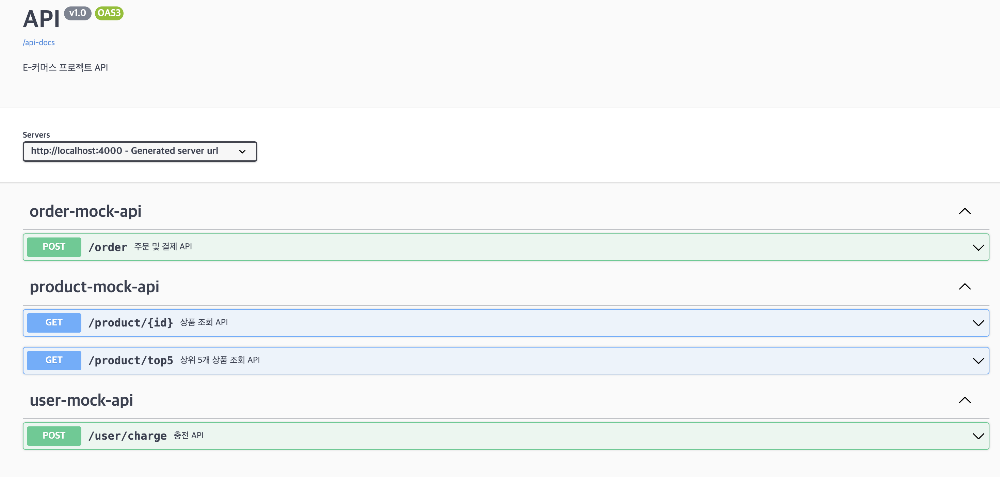
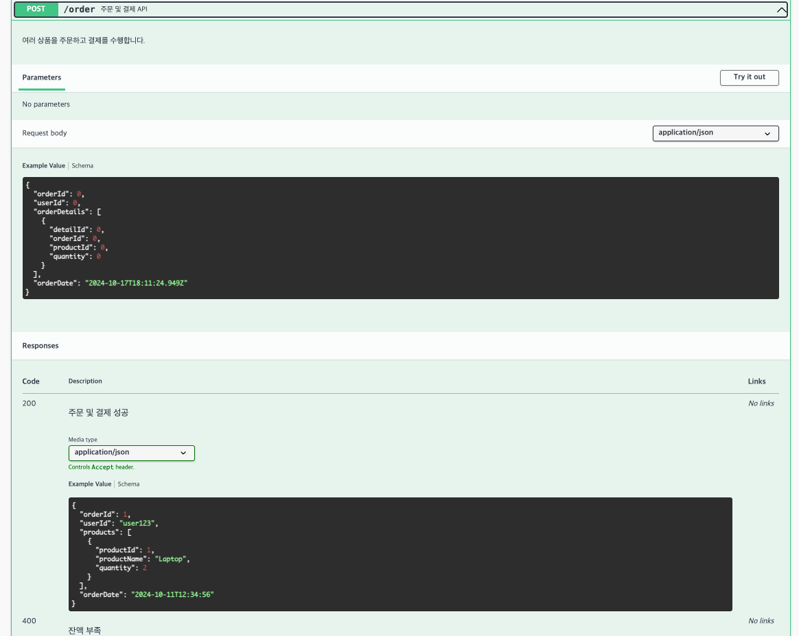
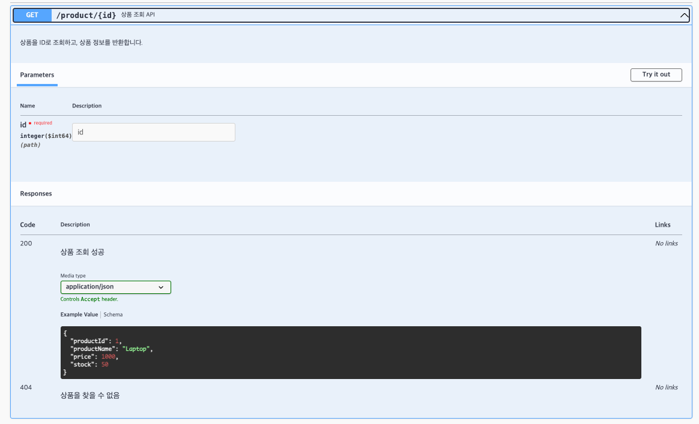
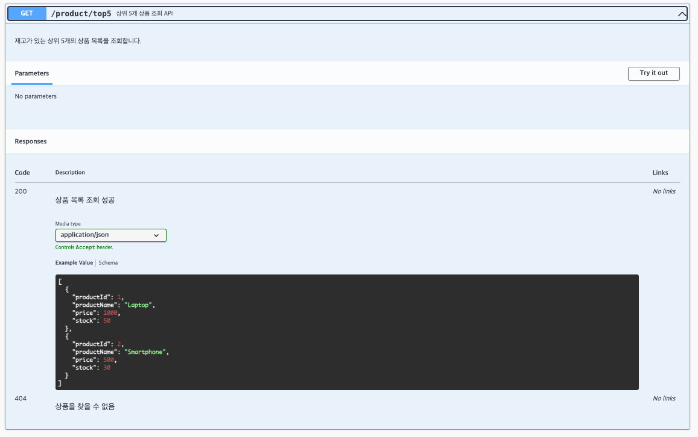
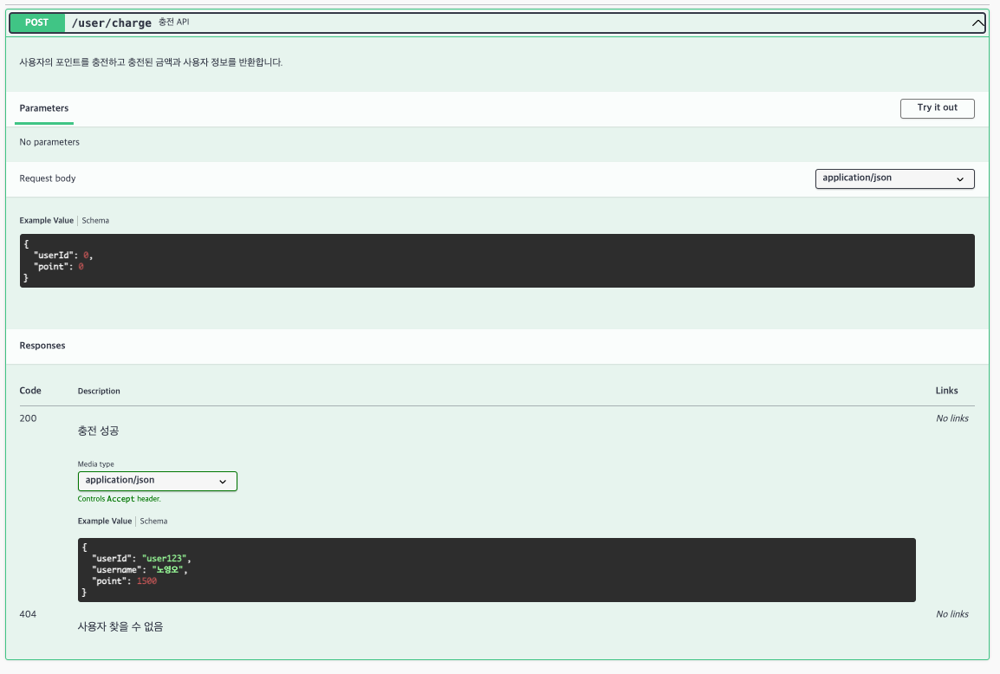

### **`DEFAULT`**

- 각 시나리오별 하기 **비즈니스 로직** 개발 및 **단위 테스트** 작성

- [x] **`e-commerce`** : 상품 조회, 주문/결제 기능

---

### **`STEP07`**

- [x] API Swagger 기능 구현 및 캡쳐본 첨부 ( Readme )
- [x] 주요 비즈니스 로직 개발 및 단위 테스트 작성

---
### DEFAULT 상품 조회, 주문/결제 기능

### 기능 개발 요약

1. **패키지 구조 설계**:
    - 각 레이어를 분리해서 작업을 진행했습니다. **Controller, Facade, Service, Repository**를 명확하게 나누어 작업하다 보니 역할이 잘 구분된 것 같습니다.
    - 아직 레이어 간의 의존성 관리가 완벽하지는 않지만, 전체적인 구조는 깔끔해졌다고 느낍니다.

2. **Facade 패턴 사용**:
    - **Facade 패턴**을 사용해 비즈니스 로직을 한곳에서 관리할 수 있게 했습니다. 이로 인해 코드 재사용이 쉬워졌고, 변경 사항이 있을 때도 **Facade에서만 처리하면** 돼서 유지보수가 좀 더 편리해질 것 같습니다.
    - 패턴을 적용하면서 느낀 점은, 복잡한 비즈니스 로직이 좀 더 **단순해 보인다**는 점입니다. 하지만 아직 **Facade와 Service 간의 역할 분리**가 더 명확해져야 할 부분이 있는 것 같습니다.

3. **비즈니스 로직의 명확한 분리**:
    - **Facade**와 **Service**로 나누다 보니, 외부에서는 **명확히 분리된 것처럼 보이지만**, 실제로는 각 서비스 간 의존성이 완전히 분리되지는 않았습니다.
    - 아직도 서비스 간의 의존성을 최소화하는 방법에 대해 고민 중입니다.

4. **서비스의 기능별 분리**:
    - **Service 계층**을 기능별로 나누니 **단위 테스트 작성**이 훨씬 쉬워졌습니다. 각 서비스가 하나의 기능만 담당하다 보니, 테스트할 때도 그 기능에만 집중할 수 있었습니다.
    - 하지만 테스트 범위가 명확하게 나뉜 만큼, **테스트 케이스 설계**에 좀 더 신경을 써야 할 것 같습니다.

결론적으로, 패키지 구조와 패턴을 사용해서 큰 틀은 잡았지만, **세부적인 레이어 간의 의존성**이나 **역할 분리**를 좀 더 다듬어야 할 필요성을 느끼고 있습니다. 앞으로 이 부분을 개선하는 것이 목표입니다.

---

### API Swagger 기능 구현 및 캡쳐본

