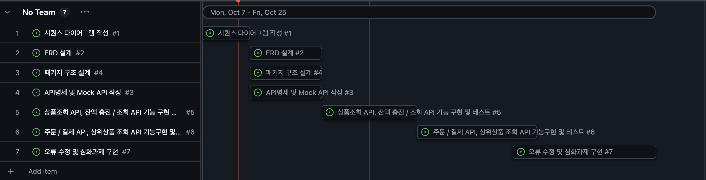
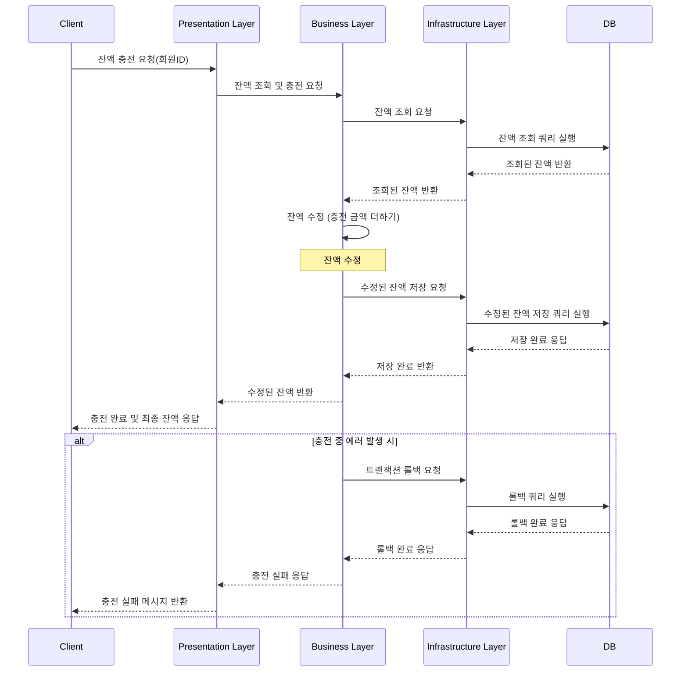
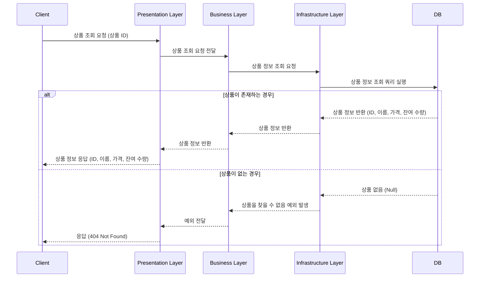
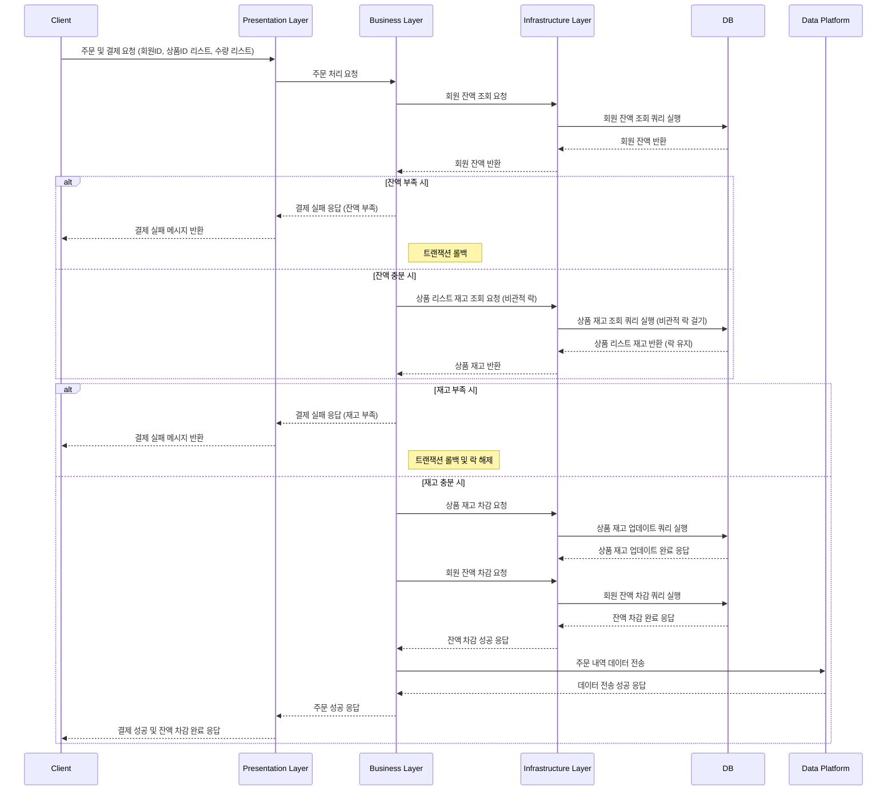
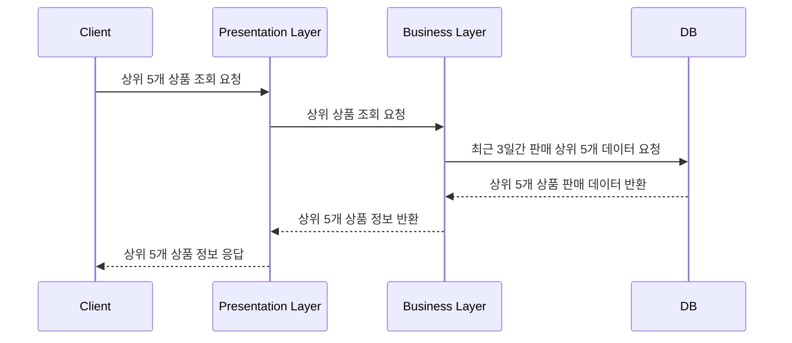

## STEP05 > CHECKLIST
### **`STEP 05`**

- [x] 시나리오 선정 및 프로젝트 Milestone 제출
- 시나리오 요구사항 별 분석 자료 제출
    - [x] 시퀀스 다이어그램
- [x] 자료들을 리드미에 작성 후 PR 링크 제출

---
## **`STEP 05`**
## STEP 05_1. Milestone

## 1. 시퀀스 다이어그램 작성 (#1)
- **기간**: 10월 7일 (월) ~ 10월 8일 (화)
- **내용**: 시스템 전반의 흐름을 정의하는 시퀀스 다이어그램 작성

## 2. ERD 설계 (#2)
- **기간**: 10월 8일 (화) ~ 10월 9일 (수)
- **내용**: 데이터베이스 설계를 위한 ERD(Entity-Relationship Diagram) 작성

## 3. 패키지 구조 설계 (#4)
- **기간**: 10월 9일 (수) ~ 10월 10일 (금)
- **내용**: 시스템 패키지 구조 정의 및 설계

## 4. API 명세 및 Mock API 작성 (#3)
- **기간**: 10월 9일 (수) ~ 10월 10일 (금)
- **내용**: API 명세서 작성 및 Mock API 구성

## 5. 상품 조회 API, 잔액 충전/조회 API 기능 구현 및 테스트 (#5)
- **기간**: 10월 11일 (토) ~ 10월 15일 (수)
- **내용**: 상품 조회 API 및 잔액 충전/조회 API 기능 구현 및 테스트

## 6. 주문/결제 API, 상위상품 조회 API 기능 구현 및 테스트 (#6)
- **기간**: 10월 16일 (목) ~ 10월 19일 (일)
- **내용**: 주문 및 결제 관련 API와 상위상품 조회 API 기능 구현 및 테스트

## 7. 오류 수정 및 심화 과제 구현 (#7)
- **기간**: 10월 20일 (월) ~ 10월 25일 (금)
- **내용**: 오류 수정 및 심화 과제 기능 추가 구현

---

## STEP05_2. 시퀀스 다이어그램

## **`잔액충전/조회 API`**

### 1. **잔액 충전/조회 API**
- **핵심**: 클라이언트가 회원 ID로 잔액 충전 요청을 보내면, 데이터베이스에서 현재 잔액을 조회하고 충전 금액을 더한 후 최종 잔액을 저장합니다. **트랜잭션**을 사용하여 데이터 일관성을 유지하고, 오류 발생 시 **트랜잭션을 롤백**합니다.

## **`상품조회 API`**

### 2. **상품 조회 API**
- **핵심**: 클라이언트가 상품 조회 요청을 보내면, 데이터베이스에서 해당 상품의 가격과 재고를 조회하여 반환합니다. 상품이 존재하지 않으면 404 응답을 반환합니다.

## **`주문/결제 API`**
### 3. **주문/결제 API**
- **핵심**: 여러 상품을 주문할 때, 각 상품의 **재고에 비관적 락**을 걸어 다른 트랜잭션이 동시에 재고를 수정하지 못하게 합니다. 잔액 확인 후 결제 성공 시 재고와 잔액을 차감하고 주문 정보를 외부 데이터 플랫폼에 전송합니다. 재고나 잔액 부족 시 **트랜잭션 롤백**으로 처리합니다.

## **`상위 상품 조회 API`**
### 4. **상위 상품 조회 API**
- **핵심**: 클라이언트가 상위 5개 상품 조회 요청을 보내면, 최근 3일간 가장 많이 판매된 상위 5개 상품 데이터를 데이터베이스에서 가져와 클라이언트에 반환합니다.
