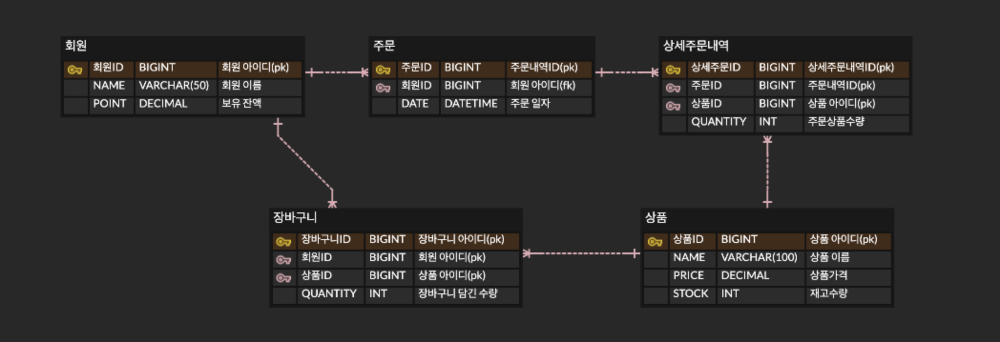

## STEP06 > CHECKLIST
### **`STEP 06`**

- [x] ERD 설계 자료 제출
- [x] API 명세 및 Mock API 작성
- [x] 자료들을 리드미에 작성 후 PR 링크 제출(채택할 기본 패키지 구조, 기술 스택 등)
---

## `ERD 설계`


## ERD 설계 설명

### 1. 회원 (회원ID, NAME, POINT)
- **회원ID**: 고유 식별자로, 각 회원을 식별하는데 사용됩니다.
- **NAME**: 회원의 이름을 저장합니다.
- **POINT**: 회원이 보유하고 있는 포인트(보상금)를 기록합니다.

### 2. 주문 (주문ID, 회원ID, DATE)
- **주문ID**: 주문의 고유 식별자입니다.
- **회원ID**: 주문을 한 회원을 참조하기 위한 외래키입니다.
- **DATE**: 주문이 이루어진 날짜 및 시간을 기록합니다.

### 3. 상세주문내역 (상세주문ID, 주문ID, 상품ID, QUANTITY)
- **상세주문ID**: 각 상세 주문의 고유 식별자입니다.
- **주문ID**: 주문과 연관된 주문을 나타내는 외래키입니다.
- **상품ID**: 주문한 상품을 나타내는 외래키입니다.
- **QUANTITY**: 주문한 상품의 수량을 나타냅니다.

### 4. 장바구니 (장바구니ID, 회원ID, 상품ID, QUANTITY)
- **장바구니ID**: 각 장바구니 내역의 고유 식별자입니다.
- **회원ID**: 장바구니를 소유한 회원을 참조하는 외래키입니다.
- **상품ID**: 장바구니에 담긴 상품을 나타내는 외래키입니다.
- **QUANTITY**: 장바구니에 담긴 상품의 수량을 나타냅니다.

### 5. 상품 (상품ID, NAME, PRICE, STOCK)
- **상품ID**: 각 상품의 고유 식별자입니다.
- **NAME**: 상품의 이름을 저장합니다.
- **PRICE**: 상품의 가격을 나타냅니다.
- **STOCK**: 상품의 재고 수량을 나타냅니다.

### 관계 설명
- **회원과 주문**: 각 회원은 여러 주문을 할 수 있지만, 각 주문은 하나의 회원에만 속합니다. 이를 위해 `회원ID`가 주문 엔티티의 외래키로 설정되었습니다.
- **주문과 상세주문내역**: 하나의 주문은 여러 상세주문내역을 가질 수 있으며, 각 상세주문내역은 하나의 주문에만 속합니다.
- **회원과 장바구니**: 각 회원은 하나의 장바구니를 가질 수 있으며, 장바구니에는 여러 상품을 담을 수 있습니다.
- **상품과 상세주문내역/장바구니**: 하나의 상품은 여러 상세주문내역과 장바구니 항목에 포함될 수 있습니다.
---

# Mock API 명세

## 서버 URL
- **로컬 서버**: `http://localhost:4000`

## `API 경로`
### POST `/order/checkout`
- **요약**: 여러 상품을 주문하고 결제를 수행합니다.
- **요청 본문**:
    - 주문할 상품 목록 및 사용자 정보를 포함한 JSON 형식의 요청
    - 예시 요청:

      ```json
      {
        "orderId": 1,
        "userId": "user123",
        "products": [
          {
            "productId": 1,
            "productName": "Laptop",
            "price": 1000.00,
            "quantity": 2
          }
        ]
      }
      ```
      
- **응답**:
    - **200**: 주문 및 결제 성공
        - 예시 응답:

          ```json
          {
            "orderId": 1,
            "userId": "user123",
            "products": [
              {
                "productId": 1,
                "productName": "Laptop",
                "price": 1000.00,
                "quantity": 2
              }
            ],
            "orderDate": "2024-10-11T12:34:56"
          }
          ```
    - **400**: 잔액 부족으로 결제 실패
        - 응답 메시지: `"잔액이 부족하여 주문을 처리할 수 없습니다."`

### `API 경로`
### GET `/product/list`
- **요약**: 상품 목록을 조회합니다.
- **요청**: 없음
- **응답**:
    - **200**: 상품 목록 조회 성공
        ```json
        [
          {
            "productId": 1,
            "productName": "Laptop",
            "price": 1000.00,
            "stock": 50
          }
        ]
        ```
    - **404**: 상품을 찾을 수 없음
    - **400**: 재고 부족


## `API 경로`
### GET `/product/top5`
- **요약**: 상위 5개의 재고가 있는 상품을 조회합니다.
- **요청**: 없음
- **응답**:
    - **200**: 상위 5개 상품 조회 성공
        ```json
        [
          {
            "productId": 1,
            "productName": "Laptop",
            "price": 1000.00,
            "stock": 50
          },
          {
            "productId": 2,
            "productName": "Smartphone",
            "price": 500.00,
            "stock": 30
          }
        ]
        ```
    - **404**: 상품을 찾을 수 없음


## `API 경로`
### POST `/user/charge`
- **요약**: 사용자의 포인트를 충전합니다.
- **요청 본문**:
    - 예시 요청:
      ```json
      {
        "userId": "user123",
        "point": 1000
      }
      ```
- **응답**:
    - **200**: 충전 성공
        ```json
        {
          "userId": "user123",
          "username": "노영오",
          "point": 1500
        }
        ```
    - **404**: 사용자 찾을 수 없음


---
- ## 패키지 구조
```
ecommerce/
├── api/                
│   ├── order/
│   │   └── OrderController
│   ├── product/
│   │   └── ProductController
│   └── user/
│       └── UserController
├── application/  
│   ├── service AND facade(?)
│   └──        
├── common/                
├── domain/               
│   ├── order/
│   │   ├── dto/
│   │   │   └── OrderDto
│   │   └── entity/
│   │       └── OrderEntity
│   ├── product/
│   │   ├── dto/
│   │   │   └── ProductDto
│   │   └── entity/
│   │       └── ProductEntity
│   └── user/
│       ├── dto/
│       │   └── UserDto
│       └── entity/
│           └── UserEntity
└── infra/                   
├── order/
│   ├── OrderEntity  
│   └── OrderRepository
├── product/
│   ├── ProductEntity
│   └── ProductRepository
└── user/
├── UserEntity
└── UserRepository
```
- ### 계층형으로 최상위패키지로 정리하고 기능이 많아질거 생각해서 도메인으로 분리해서 명확하게 하고자 생각했습니다.
- ### 기능별로 서비스로 만들어서 파사드로 묶어서 사용해볼려고 생각중입니다.
- ### 고민중인 부분은 service에 기능별로 클래스를 만들고 파사드에서 조합해서 사용하는 방식을 생각은 해보고 있습니다.
---

# 프로젝트 기술 스택


### 어느정도 세부적으로 적어야 할지 몰라서 일단 자바, 스프링, Mysql, JPA 적었고 카프카도 도입된다고 해서 일단 넣어 두었습니다.
